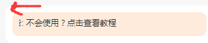
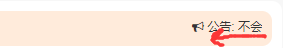

## 横屏滚动插件






用来显示横屏滚动公告,可以配置滚动速度,休止间隔,滚动跨度等等,默认宽度为`width: 100%`.可以在外层增加一个你想要的宽度的`div`.

使用方式如下: 

```html
<div id="notice">这是一个公告</div>

<!-- 依赖jquery -->
<script src="https://cdn.bootcss.com/jquery/2.2.4/jquery.min.js"></script>
<!-- 引入本库 -->
<script src="./assets/js/roll_notice.js"></script>
<script>
    roll_notice({ id: 'notice' })
</script>
```

#### DEMO
[DEMO(ch)](https://zhuobinggang.github.io/roll_notice_js/index.html?lang=ch)

[DEMO(en)](https://zhuobinggang.github.io/roll_notice_js/index.html?lang=en)